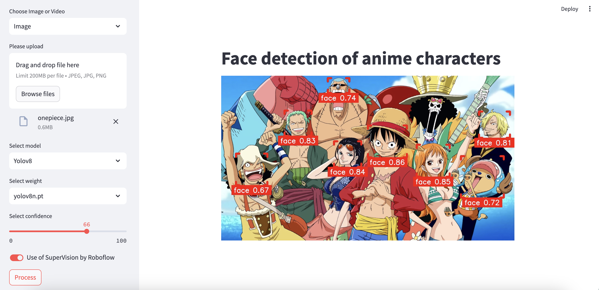

# Face detection of anime characters

## About
This project is a Streamlit web application for detecting the faces of anime characters. Models YOLOv9, YOLOv8 and 
YOLOv5 have been trained to detect the faces of anime characters.

## Process
### Data Collection
Images with anime characters are collected from [MyAnimeList](https://myanimelist.net/), using an API.
### Face Labeling
Then, the collected images were uploaded to Roboflow, an annotation tool. On this platform, the faces of anime characters 
in the images were labeled. [Preview dataset](https://universe.roboflow.com/anke/faces-of-the-characters).
### Model Training
On the Google Colab platform with T4 GPU, the YOLOv9, YOLOv8 and YOLOv5 models were trained to detect the faces of 
anime characters.
### Implementation
This project is a web application built using Streamlit, where you can upload a video or photo.

## Install
1) Clone the repository
2) Set up a virtual environment 
3) Install requirements 
4) Run: streamlit run face-detection-of-anime-characters/app.py

## Roadmap
- [ ] Increasing the dataset to 1000 images 
- [ ] Improving the labeling process (more detailed facial features)
